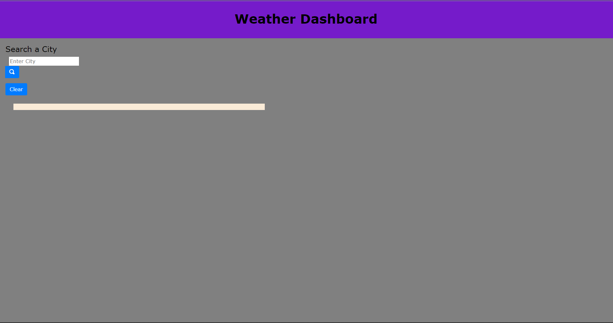

# Weather Dashboard

## Description

This project helped create a function weather dashboard application. With this application you are able to get the weather from any location via the search. This includes the temperature, uv, wind and location. The application also stores the information in local storage so you are able to pull searchs back up later to check a location again. This helped me work on my javascript writing which still needs more work but is a good base and how to add things to local storage.

## Installation

N/A

## Usage

[Link to the Weather Dashboard](https://sofuto22.github.io/Weather-Dashboard/)

## Credits

N/A

## Liscense

N/A
